# Gated BERT: A Study of Explanation and Improvement

| Section | Description |
|-|-|
| [Motivation](#motivation) | Intuitions behind this work |
| [Installation](#installation) | How to install the package |
| [Run](#run) | How to run the package and code |
| [Tour: Usage](#tour) | Overview of what the package provides |
| [Result and Observation](#result_and_observation) | Overview of results and observations |
| [Demo Adjustment](#demo_adjustment) | How to adjust the demo package for new tasks and models |
| [Acknowledgment and References](#acknowledgment_and_references) | Acknowledgment and References |

## Motivation

Here we aim to achieve the following goals:

- **Explaining the results and understanding the behaviour of the BERT model**

- **Improving the performance of BERT on GLUE tasks**

- **Obtaining interpretation-based model size reduction solution**

Borrowing from ELMo, we introduce a method called Gated BERT. The intuition behind Gated BERT is to shed a light on the behaviour of BERT to help us in obtaining more powerful and more reliable method in future. To achieve this goal, we changed the task disambiguation part of BERT -- which is simply passing the vector representation of “[CLS]” token of the last layer to a linear feedforward layer -- to a layer-wise gated mechanism. Here, we introduce a weight for every layer of the BERT which determines how much that specific layer should influence the input of the task disambiguation part (The linear feedforward layer). Each task has its own set of layer weights, so by looking at the values and their update trends, we can approximately identify the purpose and importance of different layers for different tasks. Moreover, we observe improvement on BERT performance on the development and test sets of most GLUE tasks. In parallel, we study the necessity of having all 24 layers of the BERT. We would like to shrink the model while preserving its performance and capability to make it feasible to be used in real-world applications.

<p align="center">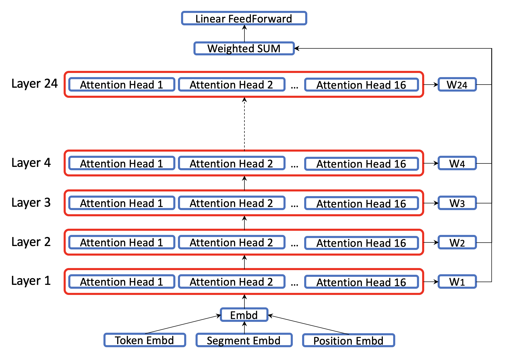</p>

## Installation

Here we have two scripts for pre-installation if required. In case of running this repo using pip installation and if you need to install Nvidia driver, Cuda and virtualenv you should run the following script:

```bash
./setup_routin.sh
```

But if you want to run this repo using docker installation and you need to install Nvidia driver, Cuda, and docker you can run the following script:

```bash
./setup_docker_routing.sh
```

Otherwise, you can skip those steps and continue with the following installation instructions. 

### Package Requirements

This repo is tested on Python 3.5+ and requires the following packages:

```bash
tqdm
boto3
regex
requests
scikit-learn
torch>=0.4.1
tensorboardX
sentencepiece
pytorch-transformers
```

Also, the demo requires the following packages:

```bash
nltk
flask
numpy
matplotlib
flask_socketio
```

Note that the demo is independent of the model and its framework. However, a bridge between demo and model should be implemented. Below we describe two installation methods for installing the package requirements:

### Pip Version

```bash
pip install -r requirements.txt
pip install -r demo/requiremtns.txt
```

### Docker Version

```bash
cd docker
./build_docker.sh
```

## Run

Here we describe the procedure for running the model and demo:

### Model

Two procedures could be followed for running and fine-tuning the model:

#### With Pip Environment

```bash
# Downloading the data:
python download_glue_data.py
cd script
# Running the experiments:
./glue_baseline_all.sh
```

#### With Docker Environment

First, you need to modify the _run_\__docker.sh_ file. You should replace the "_/Gated_\__BERT_" with its global address (not local address), so the docker mounts _Gated_\__BERT_ into the docker container as _/app_. Then:

```bash
./run_docker.sh
cd /app
# Downloading the data:
python download_glue_data.py
cd script
# Running the experiments:
./glue_baseline_all.sh
```

The _glue_\__baseline_\__all.sh_ script calls another script named _glue_\__baseline_\__test.sh_ for all tasks.

```bash
#!/bin/bash
./glue_baseline_test.sh MRPC 8
./glue_baseline_test.sh RTE 8
./glue_baseline_test.sh STS-B 8
./glue_baseline_test.sh CoLA 8
./glue_baseline_test.sh SST-2 8
./glue_baseline_test.sh QNLI 8
./glue_baseline_test.sh MNLI 8
```

Moreover, inside the _glue_\__baseline_\__test.sh_ script we determine a set arguments of _train.py_:

```bash
#!/bin/bash
if [[ $# -ne 2 ]]; then
  echo "glue_baseline_test.sh <task> <batch_size>"
  exit 1
fi
TASK_NAME=$1
BATCH_SIZE=$2
tstr=$(date +"%FT%H%M")
GLUE_DIR="../data"

python ../train.py \
    --model_type bert \
    --model_name_or_path bert-large-uncased \
    --task_name ${TASK_NAME} \
    --do_train \
    --do_eval \
    --do_lower_case \
    --data_dir ${GLUE_DIR}/${TASK_NAME} \
    --max_seq_length 128 \
    --per_gpu_eval_batch_size=${BATCH_SIZE}   \
    --per_gpu_train_batch_size=${BATCH_SIZE}   \
    --learning_rate 5e-4 \
    --num_train_epochs 10.0 \
    --output_dir "tmp/${TASK_NAME}_baseline_${tstr}/" \
    --evaluate_during_training \
    --freeze_encoder
```

### Demo

There are two methods for running the demo:

#### With Pip Environment

```bash
python demo.py --ip {localhost/server_ip} --port {selected open port} --model_type {model_name}
```

#### With Docker Environment

First you need to modify the _run_\__demo_\__docker.sh_ file. You should replace the "_/Gated_\__BERT_" with its global address (not local address), so the docker mounts _Gated_\__BERT_ into the docker container as _/app_. Then:

```bash
./run_demo_docker.sh
cd /app
python demo.py --ip {localhost/server_ip} --port {selected open port} --model_type {model_name}
```

## Tour

```bash
--Gated_BERT
 |--data
 |--demo
   |--static
   |--templates
     |--async_demo.html
     |--async_structure_analyze_d3.html
     |--async_lazy_response_d3.html
     |--async_word_analyze_d3.html
   |--async_demo.py
   |--demo_model_bridge.py
   |--plot_lib.py
 |--docker
   |--build_docker.sh
   |--Dockerfile
 |--pyencoder
   |--modeling_bert.py
 |--run_tasks
   |--run_glue.py
   |--utils_glue.py
 |--script
 |--demo.py
 |--download_glue_data.py
 |--run_docker.sh
 |--run_demo_docker.sh
 |--train.py
```

- **data**: GLUE dataset is stored in this folder.
- **demo**: Demo files are stored in this folder.
- **demo/static**: Static files for htmls like images are stored here.
- **demo/templates**: It contains all services and html files.
- **demo/templates/async\_demo.html**: Main demo html template.
- **demo/templates/async\_lazy\_response\_d3.html**: This html template will be loaded after submitting a sample. It shows all desired visualizations including (a) normalized prediction distribution, (b) embedding, layer, and attention head weights, (c) their gradient/saliency and (d) their Taylor scores (weight multiplies by its gradient).
- **demo/templates/async\_word\_analyze\_d3.html**: This template provides automatic and manual word modification capabilities. For automatic modification, 5 methods are implemented:

1. Remove: It simply removes selected tokens from the input.
2. Zero Out: It replaces the vector representation of selected token(s) with all zeros vector.
3. UNK (Unknown): It replaces the vector representation of selected token(s) with unknown token vector representation.
4. Wordnet: The demo core finds a list of single token synonym for the selected token and then randomly chooses and replaces it with the selected token.
5. Sampling: At this point, the demo assumes that there is a dictionary that captured all words, bigrams, and trigrams observed in a big source of data. So, the demo will load the dictionary (if not loaded yet) and finds all words that are seen with the current selected word's neighbourhood (trigrams and then bigrams). If it could not find any word with a similar neighbourhood, it will randomly sample a word from the vocabulary, otherwise, it will randomly sample from the found word list. Note that for building the aforementioned dictionary, you should run the following command by passing a big data source:

```bash
python demo.py --ngram_source {source file} --ngram_extraction
```

- **demo/templates/async\_structure\_analyze\_d3.html**: This html draws the given model graph and provides the capability of studying the impact of model components by turning them on and off. By clicking nodes with _group_\__id > 0_, status of the node will change (on -> off, off -> on) and a message will be sent to the server containing all on and off nodes. The server updates model mask and returns new logits and prediction to be visualized.
- **demo/async\_demo.py**: This python file is the core of the demo. It is responsible for all communications with html templates and services. This core is implemented using _flask_\__socketio_ which enables services to be asynchronized and provides message passing capability between server and client (browser). For more information about _flask_\__socketio_ you can refer to [here](https://flask-socketio.readthedocs.io/en/latest/) or its [GitHub repo](https://github.com/miguelgrinberg/Flask-SocketIO).
- **demo/demo\_model\_bridge.py**: The demo is independent of model and its framework, however, we need to implement a bridge between demo and model to communicate with it. The bridge provides information and services like parsing and tokenizing the input sample, passing the input to model and extracting all required information including weights and their gradients, and feeding the input to the modified (masked) model.
- **demo/plot\_lib.py**: This is a simple library for plotting vectors and matrixes and converting and saving them as pdf files.
- **docker**: It contains docker environment specification (_Dockerfile_) and a script for building the docker instance (_build_\__docker.sh_).
- **download\_glue\_data.py**: It downloads GLUE datasets.
```bash
python download_glue_data.py
```
- **pyencoder**: It contains the main model code. This file is mainly borrowed from [pytorch-transformers](https://github.com/huggingface/pytorch-transformers) and modified in a way to deliver the desired new features and functionalities.
- **run_tasks**: It contains a wrapper and an until functions for running GLUE tasks using _BERT/Gated BERT_ models. These files also are borrowed from [pytorch-transformers](https://github.com/huggingface/pytorch-transformers) and modified to handle and deliver new features and capabilities.
- **script**: It contains all bash scripts for running experiments. Also, experiments and their logs including tensorboard logs are stored in a tmp folder inside this folder.
- **demo.py**: This file is a simple wrapper and interface for running the demo. To run the demo, you just need to use the following script:
```bash
python demo.py --ip {localhost/server_ip} --port {selected open port} --model_type {model_name}
```
- **download\_glue\_data.py**: This python code downloads GLUE dataset. It is borrowed from [pytorch-transformers](https://github.com/huggingface/pytorch-transformers). To download datasets run the following script:
```bash
python download_glue_data.py
```
<!--- **prepare\_glue\_submit.py**: This python file is useful for the cases that you run the code on multiple servers. It automatically connects to the given servers and searches for runs and report results back to you including the best models and their test results.
```bash
python prepare_glue_submit.py
```-->
- **run\_docker.sh**: This script will run the docker and mounts the _Gated BERT_ folder as the _/app_ in the docker.
```bash
./run_docker.sh
```
- **run\_demo\_docker.sh**: This script will run the docker, mounts the _Gated BERT folder_ as _/app_ in the docker and opens a range of port that will be accessible outside the docker.
```bash
./run_demo_docker.sh
```
- **train.py**: This wrapper is responsible for running model and passing the given arguments.

## Result and Observation

### Gated BERT

BERT (embeddings and 24 layers) is initialized using the pre-trained weights. We run the BERT and Gated BERT with the same settings and compare their results when BERT weights are fixed (first category; Fixed BERT and G-BERT) and when we fine-tune whole parameters (second category; BERT + Fine-Tuning and G-BERT + Fine-Tuning).  

<p align="center">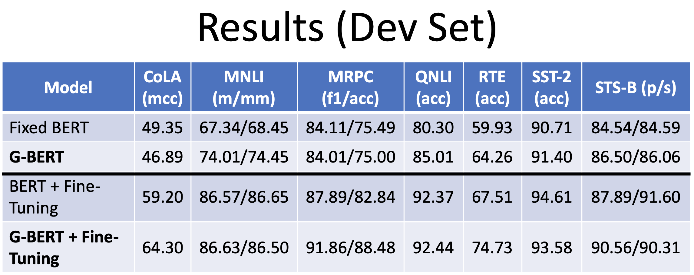</p>

<p align="center">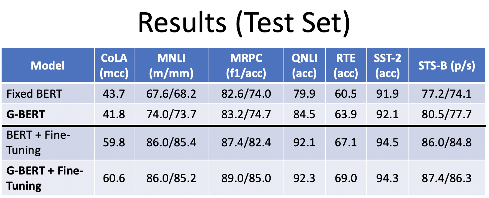</p>

The general trend indicates that _Gated BERT_ performs better than _BERT_ with and without fine-tuning.

Next, we visualize the normalized introduced layer weights for _Gated BERT_ across different tasks. STS-B is the only regression task in here and we have different behaviour for this task. In the meantime, all classification tasks deliver similar trends suggesting that top layers are the most effective layers for disambiguation.

<p align="center">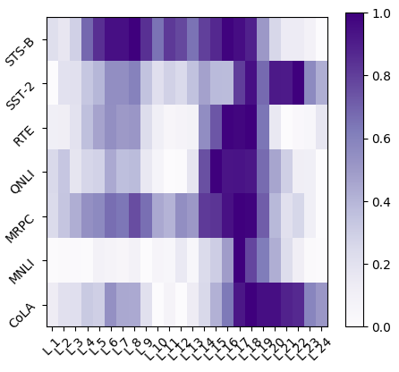</p>

Moreover, we visualize the normalized introduced layer weights for _Gated BERT + Fine-Tuning_ to see how fine-tuning changes the impact of different layers for disambiguation. Note that after fine-tuning, all weights are changed and layer behaviour are not comparable across tasks but we still can infer that after fine-tuning, most important information is captured and stored at top layers.

<p align="center">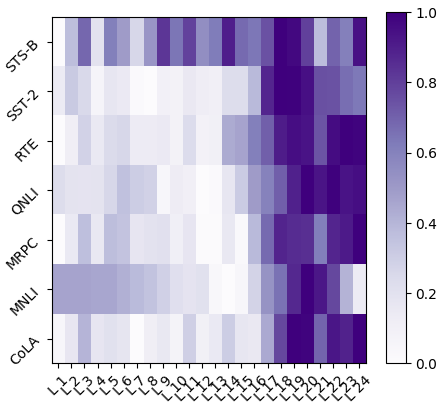</p>

### Demo

Below, we have provided a few screenshots from the demo to demonstrate how it works and what it provides. Here we focused on the sentiment analyzing task (SST-2) examining a sample of "_or doing your last year's taxes with your ex-wife ._" (the data sample is drawn from the dev set of SST-2). 

<p align="center">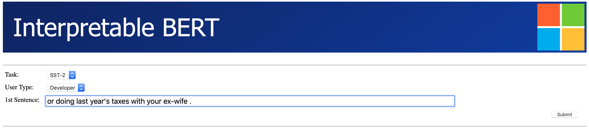</p>

After submitting the sample, the model will render and return the following page:

<p align="center">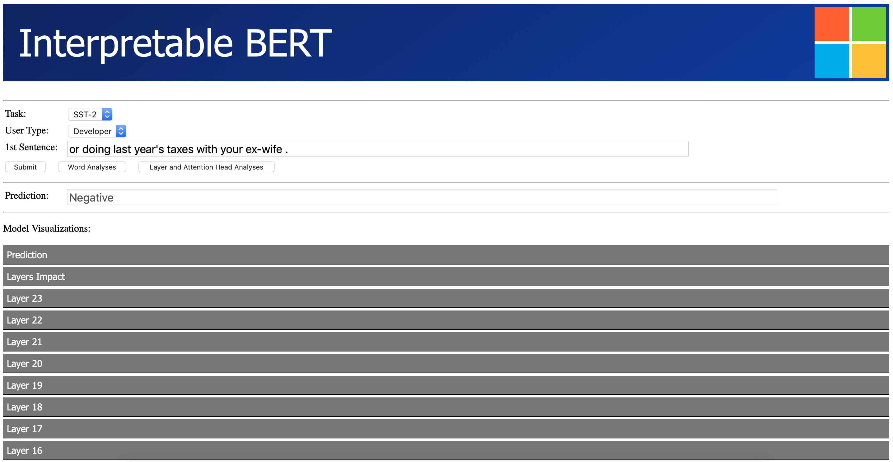</p>

<p align="center">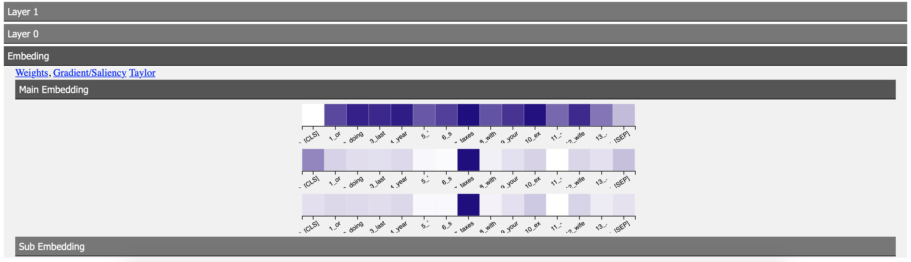</p>

The model believes the given sentence is emotionally _Negative_. The demo can help us to achieve a better understanding of the ration behind the model prediction. If we go to the embedding part, we can see that the token _taxes_ has the highest gradient/saliency and Taylor score. It suggests that _taxes_ is the key point for making the _Negative_ prediction in here.

To test this hypothesis, we can use the _Word Analyses_ component of the demo. The following figures demonstrate model behaviour before and after removing _taxes_.

<p align="center">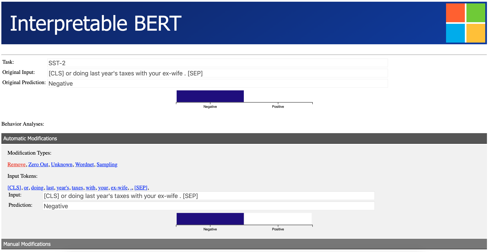</p>

<p align="center">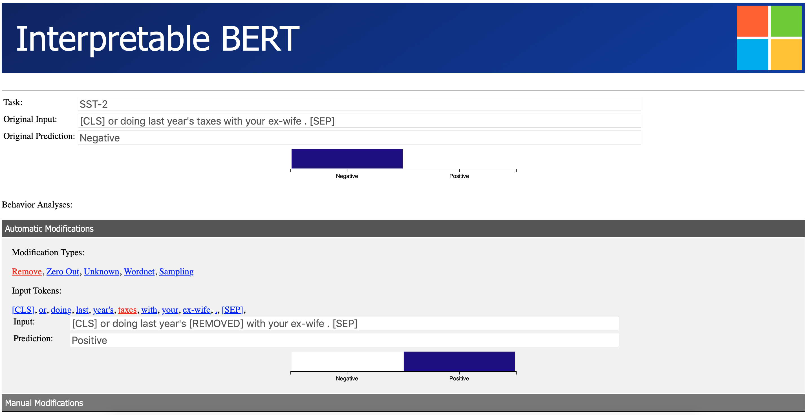</p>

Finally, you can use _Layer and Attention Head Analyses_ component to study the impact of different components in the disambiguation process as follow (note that more changes have been applied to achieve a change of prediction but they are not visible in the following figure):

<p align="center">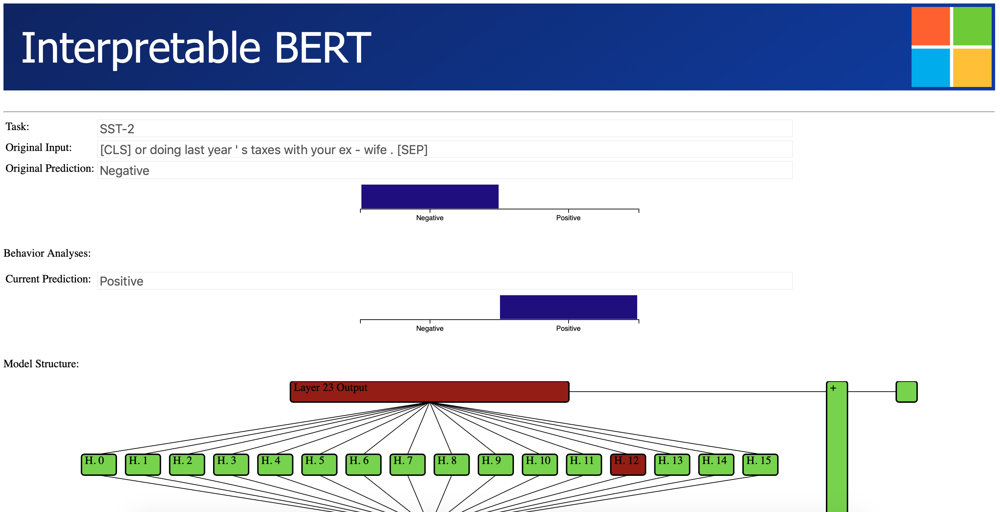</p>

## Demo Adjustment

The demo is generally model and task-independent. So, you can adjust it to visualize other models and task. The implemented demo would be a great toolbox for interpreting and debugging the behaviour of your model. We hope this toolbox sheds a light on deep models and enriches model behaviour understanding of researcher. Below we walk through different files and discuss what and how should be changed to adjust this demo for a new task and model.

### HTML Files

Templates with different capabilities have introduced under the _demo/templates_ folder. For a new model/task, you need to modify html files.

#### Async\_demo.html

- **taskcombo**: The demo can handle multiple tasks and models using a combo box called taskcombo. It shows whatever is passed to it as a list called _info["task_set"]_. We add an attribute to _option_ element called _s2_\__sts_ which is filled with _info["task_pair"]_ and it simply identifies whether the task input is a single or a pair sentence. In case of having a fixed model and task, you can remove this combo box. Note that in case of removal, you need to remove associated parts with "#taskcombo" from the html script too. 

```bash
HTML Code:
<div class="side_container">
  <label for="tasks" class="side_inbl" style="width: 6em;">Task:</label>
  <select class="side_inbl" name="taskcombo" id="taskcombo" style="font-size: 18px; height: 1em;">
     
       <option item-id="option_{{loop.index0}}" s2_sts="{{ info["task_pair"][task_index] }}" value="{{ info["task_set"][task_index] }}"  selected >{{ info["task_set"][task_index] }}</option>
     
  </select>
</div>

Script:
$(function() {
  // Hide second input entry for single input tasks
  $("#taskcombo").on("change", function(e) {
    var s2_sts = $("option:selected", this).attr("s2_sts");
    if (s2_sts == "1"){
      $("#input02").css('visibility', 'visible');
      $("#lbl02").css('visibility', 'visible');
    } else {
      $("#input02").css('visibility', 'hidden');
      $("#lbl02").css('visibility', 'hidden');
    }
  }).change();
});
```
- **usercombo**: The demo has two modes for users; User and Developer. For developer mode the demo passes and visualizes all embeddings and layers while for the User mode it only visualizes input and output of the associated model. This combo box can also be removed if only one user mode exists. In case of removal the following parts should be removed:

```bash
HTML Code:
<div class="side_container">
  <label for="users" class="side_inbl" style="width: 6em;">User Type:</label>
  <select class="side_inbl" name="usercombo" id="usercombo" style="font-size: 18px; height: 1em;">
    <option item-id="user_0" value="Developer"  selected >Developer</option>
    <option item-id="user_1" value="User"  selected >User</option>
  </select>
</div>

Script:
$(function() {
  // Hide the developer div and section
  $("#usercombo").on("change", function(e) {
    var utype = $("option:selected", this).text();
    if (utype == "Developer"){
      $("div[cat=devop]").show()
    } else {
      $("div[cat=devop]").hide()
    }
  }).change();
});
```

#### Async\_lazy\_response_d3.html

The first part of this template is the same as "_async_\__demo.html_". The rest visualizes the response from the python core. Visualization is implemented in the client-side manner. All visualizations are done using JavaScript and D3 framework by a browser. To keep the DOM file small and deliver a reasonable response time on the client, most visualizations are implemented in a lazy manner. In other words, browser only draws plots when they are required to be seen (the collapsible div is expanded). Visualization also will be removed from the DOM when they are not visible (the collapsible div is closed). All weights and visualization information are provided to the template as a JSON by _info["json"}_ variable. All visualizations are done based on the div ids.

```bash
HTML:
<div  align="center" id="W_layers_impact_div" cat='vector_draw'></div>
<div  align="center" id="G_layers_impact_div" cat='vector_draw'></div>
<div  align="center" id="T_layers_impact_div" cat='vector_draw'></div>

Script:
draw_layers_weight("#W_layers_impact_div", json.layers_impact_W);
draw_layers_weight("#G_layers_impact_div", json.layers_impact_G);
draw_layers_weight("#T_layers_impact_div", json.layers_impact_T);
```
Also, there are a set of _a_ items that basically modify the visiblity of specific divs. For example, you can hide/show specific attention heads on a specific layer, specific embedding, or either of weight/gradient/taylor visualization by clicking on the associated _a_ item. The key factor is that both _a_ and its associated div should have the same _item_\__id_ attribute.

```bash
HTML:
<a  item-id='W_L_{{layer_idx}}' for="W">Weights</a>,
<a  item-id='G_L_{{layer_idx}}' for="G">Gradient/Saliency</a>,
<a  item-id='T_L_{{layer_idx}}' for="T">Taylor</a>
<button class="collapsible" cat="layer_output" layer_idx={{layer_idx}}>Layer Output</button>
<div class="content">
  <div class="scrollmenu" align="center">
    <div class="rowscroll" align="center" style="text-align: center;">
      <div item-id='W_L_{{layer_idx}}' id="W_L_{{layer_idx}}_output_div"  align="center" cat='vector_draw' class="vector_embed"></div>
      <div item-id='G_L_{{layer_idx}}' id="G_L_{{layer_idx}}_output_div"  align="center" cat='vector_draw' class="vector_embed"></div>
      <div item-id='T_L_{{layer_idx}}' id="T_L_{{layer_idx}}_output_div"  align="center" cat='vector_draw' class="vector_embed"></div>
    </div>
  </div>
</div>

Script:
$(function(){
  $("a[item-id]").click(function(e){
    this.classList.toggle("select");
    // make the a item selected and then toggle visiblity of the associated div
    $("div[item-id="+$(e.target).attr("item-id")+"]").toggle()
  });
});
```

Visualizations are done using JavaScript and D3 framework. There are two main types of visualization functions, matrix visualization (2d) and vector visualization (1d):

```bash
// Build X scales and axis:
var x = d3.scaleBand()
  .range([ 0, width ])
  .domain(sentence)
  .padding(0.01);

// Build Y scales and axis:
var y = d3.scaleBand()
  .range([ height, 0 ])
  .domain(sentence)
  .padding(0.01);

// Build vector Y scales and axis:
var v_y = d3.scaleBand()
  .range([ vector_height, 0 ])
  .domain([''])
  .padding(0.01);

// Build color scale
var myColor = d3.scaleLinear()
  .range(["white", "#250082"])
  .domain([0,1])

// Argument for the following functions is the id of the associated div and the data that should be plotted.
function draw_matrix(id_str, data_array){
  var svg = d3.select(id_str)
    .append("svg")  // adding a svg to the div
    .attr("width", width + margin.left + margin.right)  // setting the width of the svg
    .attr("height", height + margin.top + margin.bottom)  // setting the height of the svg
    .append("g")
      .attr("transform", "translate(" + margin.left + "," + margin.top + ")");
  svg.append("g")
    .attr("transform", "translate(0," + height + ")")
    .call(d3.axisBottom(x))
    .selectAll("text")
      .style("text-anchor", "end")
      .attr("transform", "rotate(-35)");  // rotate the text
  svg.append("g")
    .call(d3.axisLeft(y));
  var heatmap = svg.selectAll()
    .data(data_array, function(d, i) {return sentence[(i%sentence.length)]+':'+sentence[Math.floor(i/sentence.length)];})  // set the data
    .enter()  // it goes through the list of the data points
      .append("rect") // adding a rectangualr at the desired position
      .attr("x", function(d, i) { return x(sentence[(i%sentence.length)]) })
      .attr("y", function(d, i) { return y(sentence[Math.floor(i/sentence.length)]) })
      .attr("width", x.bandwidth() )
      .attr("height", y.bandwidth() )
      .style("fill", function(d, i) { return myColor(d); }) // filling the rectangualr with a color considering its value d

  heatmap.append("title")
    .text(function(d) { return "value: " + d; });
}

function draw_vector(id_str, data_array){
  var svg = d3.select(id_str)
    .append("svg")
    .attr("width", width + margin.left + margin.right)
    .attr("height", vector_height + margin.top + margin.bottom)
    .append("g")
      .attr("transform", "translate(" + margin.left + "," + margin.top + ")");
  svg.append("g")
    .attr("transform", "translate(0," + vector_height + ")")
    .call(d3.axisBottom(x))
    .selectAll("text")
      .style("text-anchor", "end")
      .attr("transform", "rotate(-35)");
  var vector = svg.selectAll()
    .data(data_array, function(d, i) {return sentence[(i%sentence.length)]+':'+'';})
    .enter()
      .append("rect")
      .attr("x", function(d, i) { return x(sentence[(i%sentence.length)]) })
      .attr("y", function(d, i) { return v_y('') })
      .attr("width", x.bandwidth() )
      .attr("height", v_y.bandwidth() )
      .style("fill", function(d, i) { return myColor(d)} )

  vector.append("title")
    .text(function(d) { return "value: " + d; });
}
```

#### Async\_structure\_analyze_d3.html

Most functionality of this html file is already discussed. The new feature is the interactive communication capability of this resource with server. On the event of connection, the client automatically sends a _connect_ message to the server and server responds to the client with a message called _connect_\__response_ which contains the model graph information. Next, the client draws the given graph in a div with id of _model_\__svg_.

```bash
$(document).ready(function(){
  var socket = io('/structure_analyze');  // a namespace to refer to this specific template on the server side
  var head_status = {};  // to capture the status of the attention head
  var layer_status = {};  // to capture the status of the layers

  function draw_model(graph) {
    graph.nodes.forEach( function(d) {
      if (d.group == 1) {
        head_status[d.id] = 1;
      } else if (d.group == 2) {
        layer_status[d.id] = 1;
      }
    });
    var svg = d3.select("#model_svg"),
        width = +svg.attr("width"),
        height = +svg.attr("height");

    var simulation = d3.forceSimulation()
      .force("link", d3.forceLink().id(function(d) { return d.id; }))
      .force('x', d3.forceX().x(d => d.x))
      .force('y', d3.forceY().y(d => d.y));

    var link = svg.append("g")
      .attr("class", "links")
      .selectAll("line")
        .data(graph.links)
          .enter()
          .append("line")
          .attr("x1", function(d) { return d.x1; })
          .attr("y1", function(d) { return d.y1; })
          .attr("x2", function(d) { return d.x2; })
          .attr("y2", function(d) { return d.y2; });;

    var node = svg.append("g")
      .attr("class", "nodes")
      .selectAll("rect")
        .data(graph.nodes)
        .enter()
          .append("rect")
          .attr("width", function(d) {return d.w; })
          .attr("height", function(d) {
            if (typeof d.h == "undefined") { return graph.comp_h }
            else { return d.h }
          ;})
          .attr("rx", 4)
          .attr("x", function(d) {return d.x; })
          .attr("y", function(d) {return d.y; })
          .attr("id", function(d) {return d.id;})
          .style("stroke", "#000000")
          .style("fill", "#4fd62d" )
          .on("mouseover", function(d){  // functionality for the case of going over the node by mouse
            d3.select(this)
              .style("stroke-width", "4px")
          })
          .on("mouseleave", function(d){
            d3.select(this)
              .style("stroke-width", "2px")
          })
          .on("click", function(d){  // functionality for the case of clicking on the node
            if (d.group == 1){  // group 1 indicates attention head nodes
              if (head_status[d.id] == 1){
                d3.select(this)
                  .style("fill", "#a10505")
                head_status[d.id] = 0;
              } else {
                d3.select(this)
                  .style("fill", "#4fd62d")
                head_status[d.id] = 1;
              }
              socket.emit('change_structure', {'layer_status': layer_status, 'head_status': head_status, 'task':  $('#org_task').val(), 'input': $('#org_input').val()})  // send a change_structure message to the server including dictionary of infomation
            }
            if (d.group == 2){  // group 2 indicates layer nodes
              if (layer_status[d.id] == 1){
                d3.select(this)
                  .style("fill", "#a10505")
                layer_status[d.id] = 0;
              } else {
                d3.select(this)
                  .style("fill", "#4fd62d")
                layer_status[d.id] = 1;
              }
              socket.emit('change_structure', {'layer_status': layer_status, 'head_status': head_status, 'task':  $('#org_task').val(), 'input': $('#org_input').val()})  // send a change_structure message to the server including dictionary of infomation
            }
          })

    var node_text = svg.append("g")
      .selectAll("text")
      .data(graph.nodes)
        .enter()
          .append("text")
          .attr("x", function(d) {return d.x+5; })
          .attr("y", function(d) {return d.y + 14; })
          .text(function(d) {return d.text; })

    node.append("title")
      .text(function(d) { return d.id; });

    simulation
      .nodes(graph.nodes);

    simulation.force("link")
      .links(graph.links);
  }

  socket.on('connect_response', function(msg) {
    draw_model(msg)
  });

  // get server response for change_structure message that is already sent to the server and draw the new normalize logit
  socket.on('change_response', function(msg) {
    $('#cur_prediction').val(msg.prediction);
    cur_parse(msg.logit);
  });
});
```

#### Async\_word\_analyze_d3.html

There is no new methodology in this html file. No specific action for adjustment to a new task and model is required. The modification should be applied to the python core.

### Python Core

Here we have three python files. The plot\_lib is completely independent so there is no adjustment for this file. Below we describe the other two:

#### async\_demo.py
It handles all messages passing between model and html services. The demo starts with calling _index_ function. Clicking on any button on the main html yields calling _my_\__form_\__post_ function and this function determines the next action considering the clicked button. These functions render a template using the given information (_info_ dictionary) and pass it to the client. Note that to handle the click event on a button, the button should be under the same _form_ as others.

```python
@app.route("/")
def index():
    info = {
        "task_set": model_bridge.task_list,
        "task_pair": model_bridge.task_pair_list,
        "task_count": len(model_bridge.task_list),
        "selected_task_id": 0,
        "selected_user": "Developer",
        "input01": "",
        "input02": ""
    }
    return render_template("async_demo.html", info=info)

@app.route("/", methods=['POST'])
def my_from_post():
    inp1 = request.form['input01'].lower()
    inp2 = request.form['input02'].lower()
    task = request.form['taskcombo']
    user = request.form['usercombo']
    pairwise = (model_bridge.task_pair_list[model_bridge.task_list.index(task)] == "1")
    if request.form['submit'] == 'Submit':
        json_dict = interpretation_extraction(inp1, inp2, pairwise, task, user)
        info = {
            "task_set": model_bridge.task_list,
            "task_pair": model_bridge.task_pair_list,
            "task_count": len(model_bridge.task_list),
            "selected_task_id": model_bridge.task_list.index(task),
            "selected_user": user,
            "input01": inp1,
            "input02": inp2,
            "prediction": json_dict["prediction"],
            "head_count": head_count if len(json_dict["layers"]) > 0 else 0,
            "layer_idx": range(len(json_dict["layers"])-1, -1, -1),
            "sub_embedding_WG": ["Word", "Position", "Type"] if len(json_dict["sub_embedding_WG"]) > 0 else [],
            "json": json_dict
        }
        return render_template("async_lazy_response_d3.html", info=info)
    elif request.form['submit'] == 'Word Analyses':
        token_list, prediction, logit = word_modification_process(inp1, inp2, pairwise, task)
        info = {
            "task": task,
            "pairwise": pairwise,
            "token_list": token_list,
            "token_list_len": len(token_list),
            "token_list_cat": ['static' if (x == '[CLS]' or x == '[SEP]') else 'multi' for x in token_list],
            "original_input": ' '.join(token_list),
            "input01": inp1,
            "input02": inp2,
            "classes": model_bridge.get_class_names(task),
            "org_prediction": model_bridge.get_prediction_string(task, prediction),
            "org_logit_vector": logit
        }
        return render_template("async_word_analyze_d3.html", info=info)
    elif request.form['submit'] == 'Layer and Attention Head Analyses':
        token_list, prediction, logit = structure_modification_process(inp1, inp2, pairwise, task)
        info = {
            "model_width": model_width,
            "model_height": model_height,
            "task": task,
            "classes": model_bridge.get_class_names(task),
            "original_input": ' '.join(token_list),
            "org_prediction": model_bridge.get_prediction_string(task, prediction),
            "org_logit_vector": logit
        }
        return render_template("async_structure_analyze_d3.html", info=info)
```
Following functions are responsible for client and server interactions. Both _async_\__structure_\__analyze_\__d3.html_ and _async_\__word_\__analyze_\__d3.html_ templates send a connect and disconnect messages to the server automatically when the client is connected and disconnected respectively. Later, you can send message to the server manually too. Below we demonstrate how sent messages can be captured on server side for _async_\__word_\__analyze_\__d3.html_ template which uses the namespace of _word_\__analyze_:

```python
@socketio.on('connect', namespace='/word_analyze')
def word_analyze_connect():
    print('------------>>>>>>>>> Word Client Connected')

@socketio.on('change_modification_type', namespace='/word_analyze')
def change_modification_type_message(message):
    print('------------>>>>>>>>> Modification received!')
    task = message['task']
    method = message['type']
    org_input = message['org_input'].split(' ')
    cur_input = message['cur_input'].split(' ')
    pairwise = (model_bridge.task_pair_list[model_bridge.task_list.index(task)] == "1")
    inps, modif_inps, idx = [[], []], [[], []], 0
    for i, [ow, cw] in enumerate(zip(org_input, cur_input)):
        if ow != '[CLS]' and ow != '[SEP]':
            if ow == cw:
                inps[idx].append(ow)
                modif_inps[idx].append(ow)
            else:
                inps[idx].append(ow)
                modif_inps[idx].append(_word_modification(method, org_input, i))
        elif ow == '[SEP]':
            idx += 1
    token_list, prediction, logit = word_modification_process(' '.join(inps[0]), ' '.join(inps[1]), pairwise,
                                        task, method, ' '.join(modif_inps[0]), ' '.join(modif_inps[1]))
    response = {'text': ' '.join(token_list),
                'prediction': model_bridge.get_prediction_string(task, prediction),
                'logit': logit}
    emit('auto_response', response)  // send the response to client with message name of auto_response

@socketio.on('change_words', namespace='/word_analyze')
def change_words_message(message):
    print('------------>>>>>>>>> Change Word received! - %s'%(str(message['word_idx'])))
    task = message['task']
    method = message['type']
    word_idx = int(message['word_idx'].split('_')[1])
    org_input = message['org_input'].split(' ')
    cur_input = message['cur_input'].split(' ')
    pairwise = (model_bridge.task_pair_list[model_bridge.task_list.index(task)] == "1")
    inps, modif_inps, idx = [[], []], [[], []], 0
    for i, [ow, cw] in enumerate(zip(org_input, cur_input)):
        if cw != '[CLS]' and cw != '[SEP]':
            if i != word_idx:
                inps[idx].append(ow)
                modif_inps[idx].append(cw)
            else:
                inps[idx].append(ow)
                if ow == cw:
                    modif_inps[idx].append(_word_modification(method, org_input, i))
                else:
                    modif_inps[idx].append(ow)
        elif cw == '[SEP]':
            idx += 1
    token_list, prediction, logit = word_modification_process(' '.join(inps[0]), ' '.join(inps[1]), pairwise,
                                        task, method, ' '.join(modif_inps[0]), ' '.join(modif_inps[1]))
    response = {'text': ' '.join(token_list),
                'prediction': model_bridge.get_prediction_string(task, prediction),
                'logit': logit}
    emit('auto_response', response)  // send the response to client with message name of auto_response


@socketio.on('new_input', namespace='/word_analyze')
def new_input_message(message):
    print('------------>>>>>>>>> New Msg received!')
    task = message['task']
    pairwise = (model_bridge.task_pair_list[model_bridge.task_list.index(task)] == "1")
    inp1 = message['input01'].lower()
    inp2 = message['input02'].lower() if pairwise else ""
    _, prediction, logit = word_modification_process(inp1, inp2, pairwise, task)
    response = {'prediction': model_bridge.get_prediction_string(task, prediction),
                'logit': logit}
    emit('manual_response', response)  // send the response to client with message name of manual_response


@socketio.on('disconnect', namespace='/word_analyze')
def word_analyze_disconnect():
    print('------------>>>>>>>>> Word Client Disconnected')
```

There is no restriction on the function names. You only need to ensure that message name and namespace match with what will be sent to the server from the client.

#### demo\_model\_bridge.py

This python code is responsible for connecting the server with model. So, this is the main file that should be adjusted for other tasks and models. The demo core (_async_\__demo.py_) builds an instance of this class and all model-related communications are done using this bridge. Associated model(s) will be loaded when the \_\__init_\_\_ function is called (when you make an instance of class Bridge).

```python
class Bridge(object):

    def __init__(self, model_type):
        self.task_ids = {"MNLI": 0, "QNLI": 1, "MRPC": 2, "CoLA": 3, "RTE": 4, "SST-2": 5}
        self.task_list = ["MNLI", "QNLI", "MRPC", "CoLA", "RTE", "SST-2"]
        self.task_pair_list = ["1", "1", "1", "0", "1", "0"]
        self.head_count = 16
        self.layer_count = 24
        self.model_list = {}
        self.model_type = model_type
        self.device = torch.device("cuda" if torch.cuda.is_available() else "cpu")
        config_class, model_class, tokenizer_class = BertConfig, BertForSequenceClassification, BertTokenizer
        for task in self.task_list:
            model_path = self.get_model_path(task)
            config = config_class.from_pretrained(model_path, finetuning_task=task)
            config.keep_part_grads = True
            tokenizer_address = model_path if model_path.split('/')[-1][:10]!='checkpoint' else '/'.join(model_path.split('/')[:-1])
            tokenizer = tokenizer_class.from_pretrained(tokenizer_address, do_lower_case=True)
            model = model_class.from_pretrained(model_path, from_tf=bool('.ckpt' in model_path), config=config)
            model.to(self.device)
            self.model_list[task] = [config, tokenizer, model]
```
This class is also responsible for parsing the input and transferring input tokens to indices that should be passed to the model for prediction and disambiguation.

```python
    def parse(self, data_list, task, word_modification=False, modif_data_list=None, word_analyses=False):
        if word_modification:
            data_list[0] = self.pre_process_modif(data_list[0], modif_data_list[0])
            if len(data_list)>1:
                data_list[1] = self.pre_process_modif(data_list[1], modif_data_list[1])
        examples = [InputExample(guid=0, text_a=data_list[0], text_b=(data_list[1] if len(data_list)>1 else None), label="0")]
        tokenizer = self.model_list[task][1]
        token_count = 4 + len(data_list[0].split(' ')) + ((1 + len(data_list[1].split(' '))) if len(data_list)>1 else 0)
        features, tokens = convert_examples_to_features(examples, [], -1,
                                                    tokenizer, "regression",
                                                    cls_token_at_end=False,
                                                    cls_token=tokenizer.cls_token,
                                                    sep_token=tokenizer.sep_token,
                                                    cls_token_segment_id=0,
                                                    pad_on_left=False,
                                                    pad_token_segment_id=0,
                                                    pass_text=True, only_split=word_analyses)
        # Convert to Tensors and build dataset
        all_input_ids = torch.tensor([f.input_ids for f in features], dtype=torch.long)
        all_input_mask = torch.tensor([f.input_mask for f in features], dtype=torch.long)
        all_segment_ids = torch.tensor([f.segment_ids for f in features], dtype=torch.long)

        if word_modification:
            modif_tokens = ['[CLS]'] + ((modif_data_list[0].split(' ') + ['[SEP]'] + modif_data_list[1].split(' ')) if len(modif_data_list)>1 else modif_data_list[0].split(' ')) + ['[SEP]']
            if '[ZERO]' in modif_tokens:
                for i in range(len(modif_tokens)):
                    if modif_tokens[i] == '[ZERO]':
                        all_input_mask[0][i] = 0
                        all_input_ids[0][i] = tokenizer._convert_token_to_id(tokenizer.mask_token)
            elif '[UNK]' in modif_tokens:
                for i in range(len(modif_tokens)):
                    if modif_tokens[i] == '[UNK]':
                        all_input_ids[0][i] = tokenizer._convert_token_to_id(tokenizer.unk_token)

        batch = [all_input_ids, all_input_mask, all_segment_ids]
        return batch, tokens
```

Finally, this class provides functions for passing the parsed input to the associated model and returning the required responses.

```python
def _demo_word_change_run(self, task, batch):
        self.model_list[task][2].eval()
        batch = tuple(t.to(self.device) for t in batch)

        with torch.no_grad():
            inputs = {'input_ids':      batch[0],
                      'attention_mask': batch[1],
                      'token_type_ids': batch[2],
                      'labels':         None}
            outputs = self.model_list[task][2](**inputs)
            logits = outputs[0]
            pred = np.argmax(logits.detach().cpu().numpy(), axis=-1)

            info = {'prediction': pred,
                    'logit': logits.detach().cpu().numpy()[0],}

            return info

    def _demo_structure_change_run(self, task, batch, head_mask=None, layer_mask=None):
        self.model_list[task][2].eval()
        batch = tuple(t.to(self.device) for t in batch)

        with torch.no_grad():
            inputs = {'input_ids':      batch[0],
                      'attention_mask': batch[1],
                      'token_type_ids': batch[2],
                      'labels':         None,
                      'head_mask':      None if head_mask is None else torch.FloatTensor(head_mask).to(device=self.device),
                      'layer_mask':     None if layer_mask is None else layer_mask}
            outputs = self.model_list[task][2](**inputs)
            logits = outputs[0]
            pred = np.argmax(logits.detach().cpu().numpy(), axis=-1)

            info = {'prediction': pred,
                    'logit': logits.detach().cpu().numpy()[0],}

            return info
```

For the first part of the demo (_async_\__lazy_\__response_\__d3.html_), we need to capture value and gradient of different parts of a model. To do so, you need to compute the gradient of output (prediction) respect to the desired units and components. Below we should how the desired gradients can be computed using Pytorch:

```python
def _demo_run(self, task, batch, user):
        self.model_list[task][2].eval()
        batch = tuple(t.to(self.device) for t in batch)
        # with torch.no_grad():
        inputs = {'input_ids':      batch[0],
                  'attention_mask': batch[1],
                  'token_type_ids': batch[2],
                  'labels':         None}
        outputs = self.model_list[task][2](**inputs)
        logits = outputs[0]
        pred = np.argmax(logits.detach().cpu().numpy(), axis=-1)
        # compute the gradient of output respect to desired units and components of the model
        dy_dl = torch.ones((1,1)).to(self.device)
        tmp_model = self.model_list[task][2].module if hasattr(self.model_list[task][2], 'module') else self.model_list[task][2]
        tmp_model.prediction_vals[:,pred[0]].backward(dy_dl)
        info = {'prediction': pred[0],
                'logit': logits.detach().cpu().numpy()[0],
                'embedding': {
                                'w': tmp_model.bert.embeddings.embeddig_list[3].detach().cpu().numpy()[0],
                                'g': tmp_model.bert.embeddings.embeddig_list[3].grad.cpu().numpy()[0]
                             }
               }
        if tmp_model.bert.layer_mask_weight is None:
            info['layer_weight_impact'] = {'w': np.array([0]*(self.layer_count-1)+[1]),
                                           'g': np.array([0]*(self.layer_count-1)+[1])}
        else:
            info['layer_weight_impact'] = {'w': tmp_model.bert.layer_mask_weight.detach().cpu().numpy(),
                                           'g': tmp_model.bert.layer_mask_weight.grad.cpu().numpy()}
        if user == 'Developer':
            info['words_embedding'] = {
                            'w': tmp_model.bert.embeddings.embeddig_list[0].detach().cpu().numpy()[0],
                            'g': tmp_model.bert.embeddings.embeddig_list[0].grad.cpu().numpy()[0]
                         }
            info['position_embedding'] = {
                            'w': tmp_model.bert.embeddings.embeddig_list[1].detach().cpu().numpy()[0],
                            'g': tmp_model.bert.embeddings.embeddig_list[1].grad.cpu().numpy()[0]
                         }
            info['token_type_embedding'] = {
                            'w': tmp_model.bert.embeddings.embeddig_list[2].detach().cpu().numpy()[0],
                            'g': tmp_model.bert.embeddings.embeddig_list[2].grad.cpu().numpy()[0]
                         }
            for _layer in range(self.layer_count):
                info['attetion_layer_%d'%_layer] = {}
                info['attetion_layer_%d'%_layer]['output'] = {
                                                            'w': tmp_model.bert.encoder.layer[_layer].attention.self.context_output.detach().cpu().numpy()[0],
                                                            'g': tmp_model.bert.encoder.layer[_layer].attention.self.context_output.grad.cpu().numpy()[0]
                                                        }
                att_probs = tmp_model.bert.encoder.layer[_layer].attention.self.att_probs.detach().cpu().numpy()[0]
                att_probs_grad = tmp_model.bert.encoder.layer[_layer].attention.self.att_probs.grad.cpu().numpy()[0]
                for _head in range(self.head_count):
                    info['attetion_layer_%d'%_layer]['head_%d_probs'%_head] = {
                                                                'w': att_probs[_head],
                                                                'g': att_probs_grad[_head]
                                                            }
        return info
```

## Acknowledgment and References

At the moment, there is no paper associated with the proposed method (Gated BERT) but the intuition of our model and demo package is originated from the following works:

1. **[Interpreting Recurrent and Attention-Based Neural Models: a Case Study on Natural Language Inference](https://arxiv.org/abs/1808.03894)** by Reza Ghaeini, Xiaoli Z. Fern, Prasad Tadepalli.
2. **[Attentional Multi-Reading Sarcasm Detection](https://arxiv.org/abs/1809.03051)** by Reza Ghaeini, Xiaoli Z. Fern, Prasad Tadepalli
3. **[Saliency Learning: Teaching the Model Where to Pay Attention](https://arxiv.org/abs/1902.08649)** by Reza Ghaeini, Xiaoli Z. Fern, Hamed Shahbazi, Prasad Tadepalli.
4. **[ELMo](https://github.com/allenai/allennlp)** (from AI2) released with the paper [ELMo: Deep contextualized word representations](https://arxiv.org/abs/1802.05365) by Matthew E. Peters, Mark Neumann, Mohit Iyyer, Matt Gardner, Christopher Clark, Kenton Lee, Luke Zettlemoyer.

Please include a mention of the package and a link to the present repository if you use this work in a published or open-source project.

### References

1. **[PyTorch-Transformers](https://github.com/huggingface/pytorch-transformers)**
2. **[BERT](https://github.com/google-research/bert)** (from Google) released with the paper [BERT: Pre-training of Deep Bidirectional Transformers for Language Understanding](https://arxiv.org/abs/1810.04805) by Jacob Devlin, Ming-Wei Chang, Kenton Lee and Kristina Toutanova.
3. **[ELMo](https://github.com/allenai/allennlp)** (from AI2) released with the paper [ELMo: Deep contextualized word representations](https://arxiv.org/abs/1802.05365) by Matthew E. Peters, Mark Neumann, Mohit Iyyer, Matt Gardner, Christopher Clark, Kenton Lee, Luke Zettlemoyer.
4. **[Interpreting Recurrent and Attention-Based Neural Models: a Case Study on Natural Language Inference](https://arxiv.org/abs/1808.03894)** by Reza Ghaeini, Xiaoli Z. Fern, Prasad Tadepalli.
